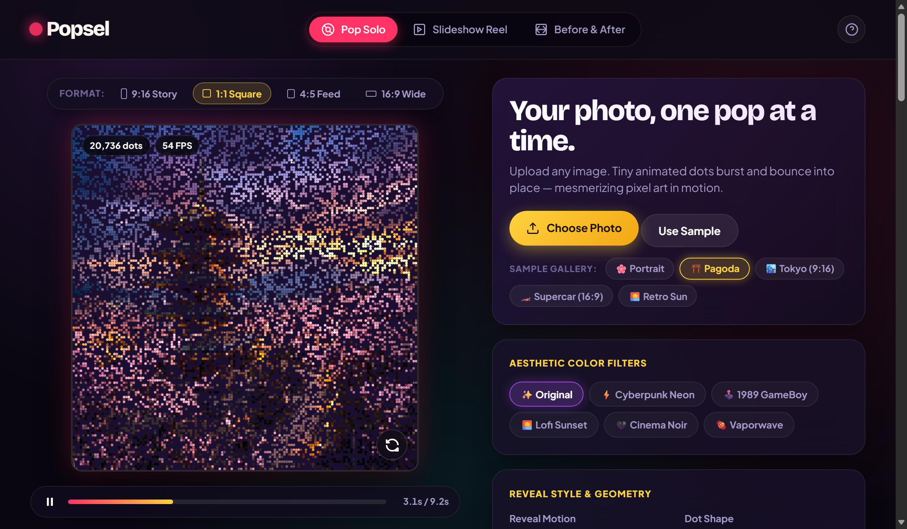

# 🫧 Popsel — Mesmerizing Pixel Reveal Studio

<div align="center">



[](https://popsel.vercel.app)
[](LICENSE)
[]()
[]()
[]()
[]()
[](https://github.com/TejaPriyan)

**Transform any photo into a mesmerizing popping-pixel animation video right in your browser.**

[🚀 Launch Studio (popsel.vercel.app)](https://popsel.vercel.app) • [⭐ Star on GitHub](https://github.com/TejaPriyan/Popsel) • [🐛 Report Bug](https://github.com/TejaPriyan/Popsel/issues)

</div>

---

## ✨ What is Popsel?

**Popsel** is a fast, 100% browser-based creative studio that turns ordinary photos into satisfying **popping-pixel reveal animations**. Each pixel bursts into existence with configurable physics, geometric shapes, and aesthetic retro filters. 

Export your creations as **60 FPS MP4/WebM video**, **animated GIF stickers**, or **HD PNG stills** with zero setup.

> 🔒 **100% Private & In-Browser.** Your photos never leave your device. All rendering, particle physics, and video encoding happen completely locally inside your browser. No files are ever uploaded to any server.

---

## 🎯 Studio Features

| Feature | Description |
|:---|:---|
| 🫧 **Pop Solo Mode** | Single photo pixel reveal with customizable particle physics, density, and animation speed |
| 🎞️ **Slideshow Reel** | Queue multiple photos for a continuous story reel video with smooth transitions |
| ↔️ **Before & After** | Interactive split-screen slider comparing the original photo with animated pixel art |
| 🎨 **6 Aesthetic Filters** | Tokyo Cyberpunk, GameBoy 1989, Lofi Sunset, Cinema Noir, Matrix, and Vaporwave |
| ⚡ **7 Reveal Physics** | Random Scatter, Sweep Left-to-Right, Sweep Top-to-Bottom, Ripple Wave, Spiral Vortex, Shadows First, and Contour Outlines |
| 🔷 **7 Geometric Dot Shapes** | Bubble Circle, Retro Square, Mosaic Diamond, Sci-Fi Hexagon, Sparkle Star, Crosshair Plus, and Heart |
| 📐 **4 Aspect Ratios** | `9:16` Story/Reels/TikTok, `1:1` Square Feed, `4:5` Portrait, and `16:9` Widescreen |
| 📤 **60 FPS Video & GIF Export** | One-tap 60 FPS MP4/WebM video download, animated GIF sticker, or HD PNG snapshot |
| 📱 **Mobile & Laptop Responsive** | Optimized interface for touch screens, smartphones, tablets, laptops, and ultra-wide monitors |
| ⌨️ **Keyboard Shortcuts** | Space to play/pause, R to replay instantly |

---

## 🚀 How to Use (No Installation Needed)

Popsel runs directly in your web browser. There is **nothing to install, clone, or configure**.

1. **Open Popsel**: Head over to **[popsel.vercel.app](https://popsel.vercel.app)**.
2. **Choose a Photo**: Drag & drop any image onto the canvas, click to browse, or pick one from the built-in sample gallery (Pagoda, Cyberpunk Supercar, Tokyo, Portrait).
3. **Select Aspect Ratio**: Switch between `9:16` (Stories/Reels/Shorts), `1:1` (Instagram Square), `4:5` (Feed), or `16:9` (YouTube/Desktop).
4. **Customize the Animation**:
   - Choose your **Reveal Motion** (e.g., Ripple, Scatter, Spiral, Edge Contour).
   - Pick your favorite **Dot Shape** (Circle, Square, Diamond, Star, Heart).
   - Apply an **Aesthetic Color Filter** (Tokyo Cyberpunk, GameBoy, Lofi Sunset, etc.).
   - Adjust dot size and reveal duration to your liking.
5. **Export in 1-Click**:
   - **🎬 Export 60 FPS Video**: Generates a high-definition 60 FPS MP4 or WebM video ready to post.
   - **👾 Export GIF Sticker**: Creates a lightweight looping animated sticker for Discord, WhatsApp, or Telegram.
   - **📸 Save HD Snapshot**: Captures a crystal-clear PNG frame of the pixel artwork.

---

## ⌨️ Keyboard Shortcuts

| Shortcut | Action |
|:---|:---|
| <kbd>Space</kbd> | Play / Pause the animation |
| <kbd>R</kbd> | Replay animation from the beginning |

---

## 🛠️ Technical Highlights

- **Pure HTML5 Canvas 2D Engine**: High-performance rendering with elastic overshoot easing curves running at a smooth 60 FPS.
- **MediaStream Recording API**: Direct in-browser video encoding with adaptive MP4/WebM codec negotiation at 14 Mbps bitrate.
- **Client-Side LZW GIF Encoder**: Lightweight, zero-dependency GIF frame quantization and palette reduction.
- **Edge-Detection Algorithm**: In-memory Sobel convolution kernel for sketch-first contour reveals.
- **Zero Dependencies**: Pure Vanilla HTML, CSS, and JavaScript. Fast initial load, zero bloat, no external npm packages needed at runtime.

---

## 📱 Browser Compatibility

| Browser | Platform | 60 FPS Video Export | GIF Export |
|:---|:---|:---:|:---:|
| **Google Chrome** | Desktop & Mobile | ✅ Supported | ✅ Supported |
| **Microsoft Edge** | Desktop & Mobile | ✅ Supported | ✅ Supported |
| **Apple Safari** | macOS, iPadOS, iOS | ✅ Supported | ✅ Supported |
| **Mozilla Firefox** | Desktop & Mobile | ✅ Supported | ✅ Supported |
| **Samsung Internet** | Mobile | ✅ Supported | ✅ Supported |

---

## 📄 License

This project is open-source and released under the [MIT License](LICENSE).

```text
MIT License

Copyright (c) 2026 Teja Priyan

Permission is hereby granted, free of charge, to any person obtaining a copy
of this software and associated documentation files (the "Software"), to deal
in the Software without restriction, including without limitation the rights
to use, copy, modify, merge, publish, distribute, sublicense, and/or sell
copies of the Software, and to permit persons to whom the Software is
furnished to do so, subject to the following conditions:

The above copyright notice and this permission notice shall be included in all
copies or substantial portions of the Software.
```

---

## 👤 Author & Acknowledgments

**Created by [Teja Priyan](https://github.com/TejaPriyan)**

- Live Website: **[https://popsel.vercel.app](https://popsel.vercel.app)**
- GitHub Repository: **[https://github.com/TejaPriyan/Popsel](https://github.com/TejaPriyan/Popsel)**

---

<div align="center">

Made with ❤️ and HTML5 Canvas

**Popsel** — *See every pixel pop.*

</div>
