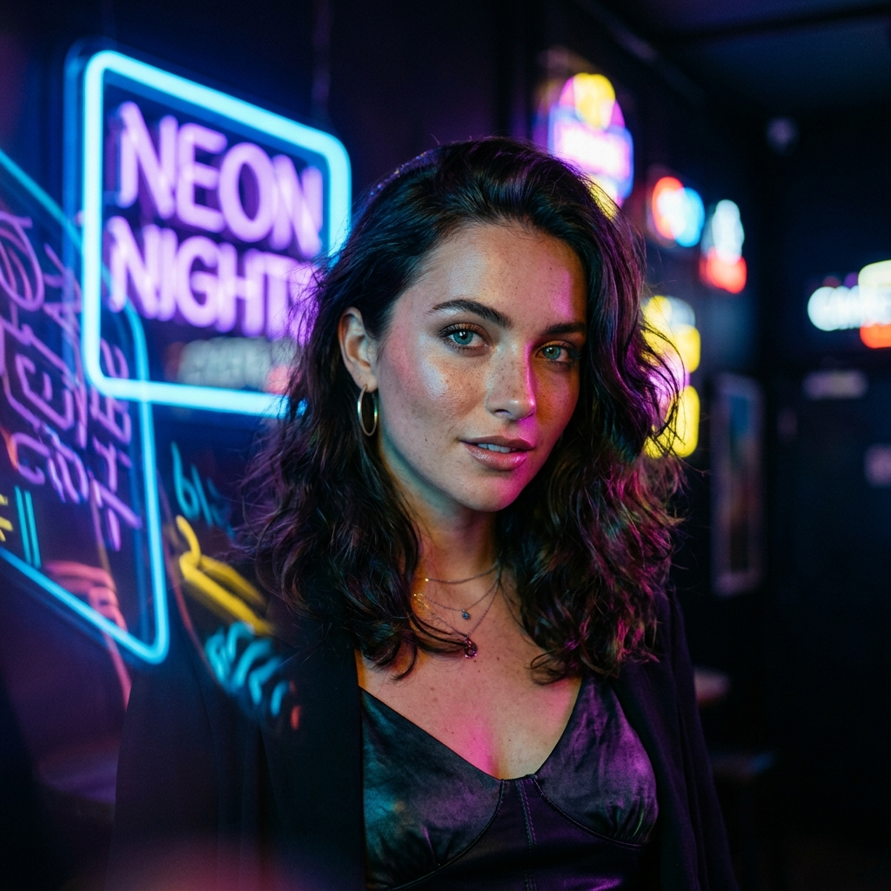

# 🫧 Popsel — Audio-Reactive Pixel Reveal Studio

<div align="center">



[](LICENSE)
[](https://developer.mozilla.org/en-US/docs/Web/API/Canvas_API)
[](https://developer.mozilla.org/en-US/docs/Web/API/Web_Audio_API)
[]()
[](https://github.com/TejaPriyan)

**Transform any photo into a mesmerizing popping-pixel animation video — with or without audio.**

[🔴 Live Demo](https://tejapriya.github.io/Popsel) • [📦 Download](https://github.com/TejaPriyan/Popsel/archive/refs/heads/main.zip) • [🐛 Report Bug](https://github.com/TejaPriyan/Popsel/issues)

</div>

---

## ✨ What is Popsel?

**Popsel** is a high-performance, 100% browser-based creative studio that turns ordinary photos into satisfying **popping-pixel reveal animations**. Each pixel "pops" into existence with configurable physics, aesthetics, and optional audio — from synthesized ASMR bubble pops to your own custom music. Export as **60 FPS MP4/WebM video**, **animated GIF**, or **PNG still**.

> 🔒 **100% private.** Your photos never leave your device. All rendering, audio synthesis, and video encoding happen entirely in your browser.

---

## 🎯 Key Features

| Feature | Description |
|---------|-------------|
| 🫧 **Pop Solo Mode** | Single photo pixel reveal with full animation control |
| 🎞️ **Slideshow Reel** | Queue multiple photos for a continuous story reel video |
| ↔️ **Before & After** | Draggable pixel wipe comparison between original and pixelated |
| 🔊 **Audio Freedom** | Select Audio (ASMR, Synthwave, Lo-Fi, Custom MP3) **or** Silent Video |
| 🎨 **6 Aesthetic Filters** | Tokyo Cyberpunk, GameBoy 1989, Lofi Sunset, Cinema Noir, Matrix, Vaporwave |
| ⚡ **7 Reveal Physics** | Random, Radial, Contour Edge, Luminance Depth, Spiral, Rain, Wave |
| 🔷 **7 Dot Shapes** | Circle, Square, Rounded Square, Diamond, Star, Cross, Triangle |
| 📐 **4 Aspect Ratios** | 9:16 Story, 1:1 Square, 4:5 Feed, 16:9 Widescreen |
| 📤 **Multi-Format Export** | 60 FPS HD MP4/WebM, Animated GIF (Discord/Telegram sticker), PNG |
| ⌨️ **Keyboard Shortcuts** | Space to pause/play, R to replay |
| 📱 **Fully Responsive** | Mobile, tablet, laptop, and widescreen desktop |

---

## 🔊 Audio Options

Popsel gives you **explicit control** over video audio:

| Option | Description |
|--------|-------------|
| 🔇 **No Audio (Silent Video)** | Pure silent video — zero audio tracks in output file |
| 🫧 Bubble Pop | Classic ASMR procedural synthesis |
| 🕹️ 8-Bit Retro Blip | Chiptune-style synthesized pops |
| 🎋 Bamboo Woodblock | Natural percussion synthesis |
| 💧 Water Droplet | Watery tap synthesis |
| ⌨️ Mechanical Click | Keyboard-click satisfying pops |
| 🎧 Synthwave Beats | 120 BPM procedural synthwave music |
| ☕ Chill Lo-Fi Beat | Lo-fi drum beat synthesis |
| 📁 **Custom MP3/WAV** | Upload your own song and sync to pixel reveal |

> All audio is **procedurally generated** using the Web Audio API — no external sound files required.

---

## 🚀 Getting Started

### Option 1: Open Directly (Recommended)
```bash
# Clone the repository
git clone https://github.com/TejaPriyan/Popsel.git

# Navigate into the folder
cd Popsel/popsel

# Open in your browser (any of these work)
# Double-click index.html
# OR run a local server:
python -m http.server 3456
# Then open: http://localhost:3456
```

### Option 2: Run with Node.js
```bash
npx serve ./popsel
```

> ⚠️ **Note:** Some audio/video features require a web server (not file:// protocol). Use the Python or Node server above.

---

## 🎮 How to Use

1. **Upload a photo** — drag & drop onto the canvas, or click to browse, or pick one of the sample photos
2. **Choose your aspect ratio** — 9:16 for TikTok/Reels, 1:1 for Instagram, 16:9 for YouTube
3. **Select your audio** — choose an ASMR style, music, or pick "No Audio" for silent video
4. **Adjust physics** — pixel size, reveal pattern, dot shape, animation duration, bounce elasticity
5. **Apply a filter** — Cyberpunk, GameBoy, Lofi, Noir, Matrix, or original colors
6. **Export** — download as a 60 FPS MP4 video, animated GIF, or PNG snapshot

### ⌨️ Keyboard Shortcuts
| Key | Action |
|-----|--------|
| `Space` | Play / Pause animation |
| `R` | Replay from start |

---

## 📂 Project Structure

```
Popsel/
└── popsel/
    ├── index.html              # Main app — SEO, AEO, GEO optimized
    ├── style.css               # Full design system — dark mode, responsive
    ├── app.js                  # Core engine — canvas, audio, recording
    ├── sample1.jpg             # Sample: Portrait photo
    ├── sample2.jpg             # Sample: Landscape / nature
    ├── sample3.jpg             # Sample: Pagoda architecture
    ├── sample4.jpg             # Sample: Supercar
    ├── google87bb3bc53ec346d2.html  # Google Search Console verification
    └── README.md               # This file
```

---

## 🛠️ Technical Architecture

### Canvas Engine
- **Pure HTML5 Canvas 2D** — no WebGL, no external libraries
- **60 FPS requestAnimationFrame** render loop with elastic spring physics
- Per-pixel particle system with delay arrays, bounce-back easing, and luminance-aware spawning
- Sobel edge detection for contour-first reveal order

### Audio Engine (`PopSoundEngine`)
- **Procedural Web Audio API synthesis** — zero external `.mp3` / `.ogg` files
- Oscillator-based ASMR pop types: bubble, retro, woodblock, water, click
- Beat-sync analyser: FFT bass energy drives particle scale pulses
- Beats: 120 BPM Synthwave, Chill Lo-Fi — both procedurally generated
- Custom audio: decode MP3/WAV via AudioContext, playback with loop sync
- **Silent mode**: disables all audio tracks; `MediaRecorder` records pure video stream

### Recording Engine
- `canvas.captureStream(60)` — captures canvas at 60 FPS
- Audio track muxed in only when audio mode ≠ silent
- Supports `video/mp4` (Safari/Chrome) and `video/webm` (Firefox) automatically
- Downloads as `popsel-{ratio}-{timestamp}.mp4` / `.webm`

### GIF Encoder
- Pure JavaScript LZW GIF encoder — no libraries
- 16-frame sample at 360px for Discord/Telegram sticker size
- Palette quantization: full-color to 256-color via median-cut

---

## 🌐 SEO, AEO & GEO

Popsel is fully optimized for search engines and AI answer engines:

- **SEO**: Title tags, meta description, keywords, canonical URL, `robots` directives
- **Open Graph**: Facebook/Discord rich link previews
- **Twitter Cards**: summary_large_image cards
- **Google Verification**: `google87bb3bc53ec346d2` meta tag + HTML file
- **AEO** (Answer Engine Optimization): JSON-LD `FAQPage` schema for ChatGPT/Perplexity
- **GEO** (Generative Engine Optimization): JSON-LD `WebApplication` schema for AI search engines
- **Semantic HTML5**: Visible FAQ section for crawlers

---

## 📱 Browser Compatibility

| Browser | Support |
|---------|---------|
| Chrome / Edge (desktop) | ✅ Full — MP4 + Audio |
| Safari (macOS / iOS) | ✅ Full — MP4 + Audio |
| Firefox | ✅ Full — WebM + Audio |
| Chrome Android | ✅ Full — MP4 + Audio |
| Samsung Internet | ✅ Works |

---

## 🔒 Privacy Guarantee

> **Popsel never uploads your photos, audio, or videos to any server.**

All processing happens locally in your browser:
- Canvas rendering — CPU/GPU local
- Audio synthesis — Web Audio API local
- Video encoding — MediaRecorder API local
- GIF encoding — JavaScript local

---

## 🎨 Sample Photos

Popsel includes 4 built-in sample photos to get you started instantly:

| Sample | Description |
|--------|-------------|
| 👤 Portrait | Studio portrait — great for profile reveals |
| 🌿 Nature | Vertical nature photo — ideal for 9:16 Story |
| ⛩️ Pagoda | Japanese architecture — cinematic detail |
| 🏎️ Supercar | Sports car — dynamic dot reveal |

---

## 📄 License

MIT License — free to use, modify, and distribute. Attribution appreciated.

---

## 👤 Creator

**Created by [Teja Priyan](https://github.com/TejaPriyan)**

Popsel was designed and built as an open-source, private, in-browser creative studio for digital creators, artists, content producers, and short-form video enthusiasts.

---

<div align="center">

Made with ❤️, HTML5 Canvas, Web Audio API & MediaStream Recording API

**Popsel 2026** — *See every pixel pop.*

</div>
